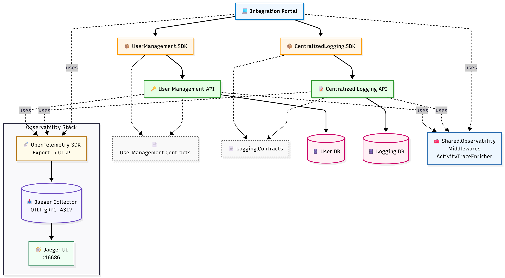

# 🛰️ ConsistentAuthZ — Distributed-ready centralized authorization with Redis and stale-claim-safe live permission updates.

[](https://github.com/hasanjaved-developer/CentralizedLoggingMonitoring/actions/workflows/dotnet-tests.yml)
[](https://codecov.io/gh/hasanjaved-developer/ConsistentAuthZ)
[](https://github.com/hasanjaved-developer/ConsistentAuthZ/actions/workflows/docker-compose-ci.yml)
[](LICENSE.txt)
[](https://github.com/hasanjaved-developer/ConsistentAuthZ/tags)
[](https://ghcr.io/hasanjaved-developer/consistent-authz/api)
[](https://ghcr.io/hasanjaved-developer/consistent-authz/userapi)
[](https://ghcr.io/hasanjaved-developer/consistent-authz/web)

### 🐳 Docker Hub Images

| Service | Pulls | Size | Version |
|----------|-------|------|----------|
| **API** | [](https://hub.docker.com/r/hasanjaveddeveloper/consistent-authz-api) | [](https://hub.docker.com/r/hasanjaveddeveloper/consistent-authz-api/tags) | [](https://hub.docker.com/r/hasanjaveddeveloper/consistent-authz-api/tags) |
| **User API** | [](https://hub.docker.com/r/hasanjaveddeveloper/consistent-authz-userapi) | [](https://hub.docker.com/r/hasanjaveddeveloper/consistent-authz-userapi/tags) | [](https://hub.docker.com/r/hasanjaveddeveloper/consistent-authz-userapi/tags) |
| **Web (Portal)** | [](https://hub.docker.com/r/hasanjaveddeveloper/consistent-authz-web) | [](https://hub.docker.com/r/hasanjaveddeveloper/consistent-authz-web/tags) | [](https://hub.docker.com/r/hasanjaveddeveloper/consistent-authz-web/tags) |

This project demonstrates **consistent authorization between a Web App and APIs,** backed by **Redis-cached permissions** and **automatic refresh on role change,** without forcing user logout.

It runs as a **single-node, modular application**, but follows a **distributed-ready design** with clear service boundaries and optional RabbitMQ support for future event-driven scaling.

**Key Idea:**
UI and API must always agree on what the user can do — authorization should be a system capability, not scattered checks.

---

## ✨ Features
| Capability                          | Description                                          |
| ----------------------------------- | ---------------------------------------------------- |
| ✅ Centralized permission model      | Roles & permissions stored in DB, not in controllers |
| ✅ Redis permission cache            | Fast lookup on every request                         |
| ✅ Automatic invalidation            | Redis cache cleared on role change — no stale access |
| ✅ UI & API use same source of truth | Eliminates mismatch (link visible but API denies)    |
| ✅ Graceful UX                       | No forced logout; UI updates on next action          |
| ✅ Unauthorized demo                 | See incorrect state → fix → observe correct behavior |
| ✅ Distributed-ready               | Web + API boundaries, optional RabbitMQ              |
| ✅ Observability friendly            | Designed to show 401/403 traces + refresh flow       |


---

## 👀 Demo Scenarios
| Scenario              | What happens                                         |
| --------------------- | ---------------------------------------------------- |
| User lacks permission | UI might show link → API rejects with 403            |
| Admin grants role     | Redis entry removed → user gets access on next click |
| Admin revokes role    | Cache cleared → user loses access instantly          |
| User tries old link   | UI blocks or API returns 403 → redirect to home      |


---

## ⭐ Developer Explanation Text

The project begins with UI-only permission to intentionally demonstrate an inconsistent state: the user sees the feature link but the API denies access. After enabling API permission and clearing the Redis cache, both layers align. When permissions are removed again, the UI hides the link and the API blocks the request — all without forcing logout or leaving stale access behind.

---

## 🧩 Architecture Snapshot

  
<sub>[View Mermaid source](docs/integration_portal_architecture.mmd)</sub>

---

### 📸 Screenshots

### 🔑 Jaeger


---

## 🔍 Quick Start (Preview)

```bash
# Clone the repository
git clone https://github.com/hasanjaved-developer/consistent-authz.git
cd consistent-authz

# Start the observability stack
docker compose -f docker-compose.yml up -d
```
---

## 📜 License

This project is licensed under the MIT License.

---
